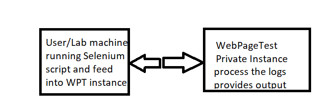

# SeleniumWPT

When we want to capture or analyse the webpage performance of a functional flow, rather than single webpage alone, this code might come
handy to anyone.

It contains 2 java files

WebPageTest.java 
   A standalone java code to accept and process the logs sent from TestChrome.java
    
TestChrome.java 
     A simple selenium based java code, which uses chromedriver with its chromOption to enable performance logs during intial setup, does the automated transactions and then feed into Webpagetest private instance thro WebPageTest.java  
After the execution of TestChrome, the output will given similar to below  
The results are available at http://<wpt private instance host>:<port>/result/<folder>

